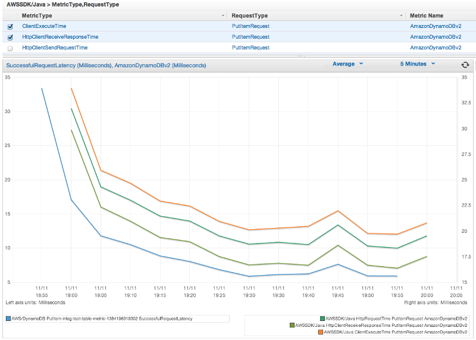
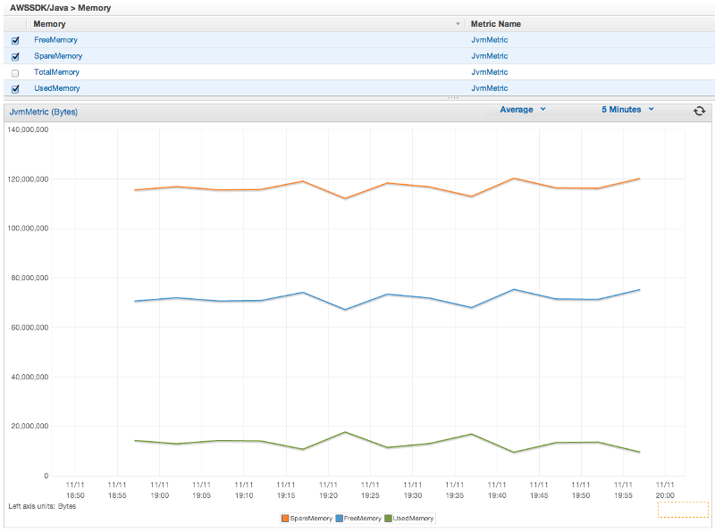

//!!NODE_ROOT <section>
include::../../includes.txt[]
[."topic"]
[[generating-sdk-metrics,generating-sdk-metrics.title]]
= [[enabling-metrics-for-the-sdk-java, Enabling Metrics for the SDK for Java]]Enabling Metrics for the {sdk-java}
:info_doctype: section
:info_title: Enabling Metrics for the {sdk-java}

The {sdk-java} can generate metrics for visualization and monitoring with  link:cloudwatch/["CloudWatch", type="marketing"] that measure:

* your application's performance when accessing {AWS}
* the performance of your JVMs when used with {AWS}
* runtime environment details such as heap memory, number of threads, and opened file descriptors

[[how-to-enable-sdk-java-metric-generation,how-to-enable-sdk-java-metric-generation.title]]
== How to Enable Java SDK Metric Generation

{sdk-java} metrics are  __disabled by default__. To enable it for your local development environment, include a system property that points to your {AWS} security credential file when starting up the JVM. For example:

[source,java]
----
-Dcom.amazonaws.sdk.enableDefaultMetrics=credentialFile=/path/aws.properties
----

You need to specify the path to your credential file so that the SDK can upload the gathered datapoints to CloudWatch for later analysis.

[NOTE]
====

If you are accessing {AWS} from an {EC2} instance using the {EC2} instance metadata service, you don't need to specify a credential file. In this case, you need only specify:

[source,java]
----
-Dcom.amazonaws.sdk.enableDefaultMetrics
----

====

All metrics captured by the {sdk-java} are under the namespace  **AWSSDK/Java**, and are uploaded to the CloudWatch default region (__us-east-1__). To change the region, specify it by using the `cloudwatchRegion` attribute in the system property. For example, to set the CloudWatch region to __{region_api_default}__, use:

[source,java]
----
-Dcom.amazonaws.sdk.enableDefaultMetrics=credentialFile=/path/aws.properties,cloudwatchRegion={region_api_default}
----

Once you enable the feature, every time there is a service request to {AWS} from the {sdk-java}, metric data points will be generated, queued for statistical summary, and uploaded asynchronously to CloudWatch about once every minute. Once metrics have been uploaded, you can visualize them using the  https://console.aws.amazon.com/console/home[{console}] and set alarms on potential problems such as memory leakage, file descriptor leakage, and so on.

[[available-metric-types,available-metric-types.title]]
== Available Metric Types

The default set of metrics is divided into three major categories:

{AWS} Request Metrics::
* Covers areas such as the latency of the HTTP request/response, number of requests, exceptions, and retries.
+

{AWS-service} Metrics::
* Include {AWS-service}-specific data, such as the throughput and byte count for S3 uploads and downloads.
+
image::images/ServiceMetric-131111.png[scaledwidth=100%]

Machine Metrics::
* Cover the runtime environment, including heap memory, number of threads, and open file descriptors.
+

+

If you want to exclude Machine Metrics, add  `excludeMachineMetrics` to the system property:
+
[source,java]
----
-Dcom.amazonaws.sdk.enableDefaultMetrics=credentialFile=/path/aws.properties,excludeMachineMetrics
----

[[more-information,more-information.title]]
== More Information

* See the link:sdk-for-java/v1/reference/com/amazonaws/metrics/package-summary.html["amazonaws/metrics package summary", type="documentation"] for a full list of the predefined core metric types.
* Learn about working with CloudWatch using the {sdk-java} in xref:examples-cloudwatch[CloudWatch Examples Using the {sdk-java},linkend=examples-cloudwatch].
* Learn more about performance tuning in link:developer/tuning-the-aws-sdk-for-java-to-improve-resiliency["Tuning the pass:q[[.shared\]`Javalong`] to Improve Resiliency", type="blog"] blog post.
